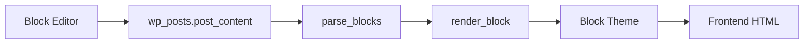
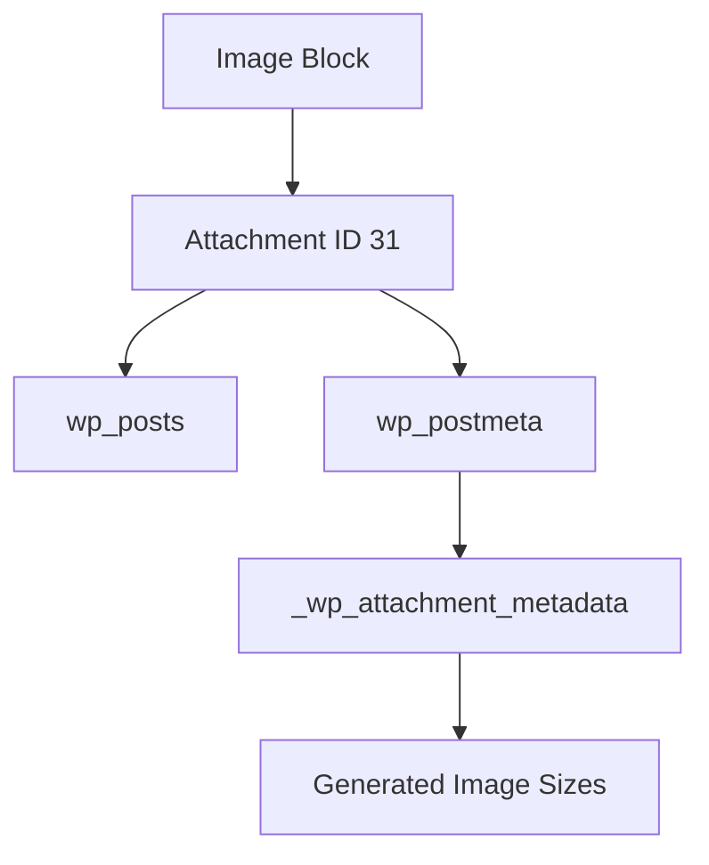

# WordPress Block Theme: Database → Parser → Render Flow

This document explains how WordPress stores Gutenberg blocks in the database and renders them on the frontend using a Block Theme.

---

## How Gutenberg Stores Content

When a post is created in the Block Editor, WordPress stores the content inside the `wp_posts.post_content` field as serialized block markup.

### Example

```html
<!-- wp:paragraph -->
<p>Hello World</p>
<!-- /wp:paragraph -->

<!-- wp:image {"id":31,"sizeSlug":"large","linkDestination":"none"} -->
<figure class="wp-block-image size-large">
    
</figure>
<!-- /wp:image -->
```

---

## Database Structure

### Post Content

| Field          | Description                       |
| -------------- | --------------------------------- |
| `ID`           | Unique post ID                    |
| `post_type`    | post, page, attachment, etc.      |
| `post_status`  | publish, draft, inherit           |
| `post_content` | Serialized Gutenberg block markup |

### Example

| ID | post_type  | post_status |
| -- | ---------- | ----------- |
| 41 | post       | publish     |
| 31 | attachment | inherit     |

---

## Request Lifecycle



---

## Block Parsing

WordPress converts block markup into structured block objects.

```php
$blocks = parse_blocks( $post->post_content );
```

### Example Output

```php
Array(
    [0] => Array(
        [blockName] => "core/paragraph"
        [attrs] => Array()
    )
)
```

---

## Rendering Blocks

Each block is rendered individually.

```php
echo render_block( $block );
```

### Output

```html
<p>Hello World</p>
```

---

## Image Block Relationship



---

## Block Theme Rendering Flow

```mermaid
flowchart LR
    A[Block Editor]
    B[wp_posts.post_content]
    C[parse_blocks()]
    D[render_block()]
    E[Theme Template]
    F[Frontend HTML]

    A --> B
    B --> C
    C --> D
    D --> E
    E --> F
```

---

## Template Resolution

When a visitor opens a post, WordPress selects the appropriate Block Theme template.

Typical hierarchy:

```text
single-post.html
single.html
page.html
index.html
```

---

## Site Editor Templates

Templates modified through the Site Editor are stored in the database as custom post types.

```text
wp_template
wp_template_part
```

These records are also stored inside the `wp_posts` table.

---

## Dynamic vs Static Blocks

### Static Blocks

Rendered directly from saved content.

Examples:

* Paragraph
* Heading
* Image
* List

### Dynamic Blocks

Rendered at runtime.

Examples:

* Latest Posts
* Query Loop
* Site Title
* Navigation

---

## Complete Architecture

```mermaid
flowchart TD

    A[User Creates Content]
    --> B[Block Editor]

    B --> C[wp_posts.post_content]

    C --> D[Visitor Requests URL]

    D --> E[WP_Query]

    E --> F[Load Post Data]

    F --> G[parse_blocks()]

    G --> H[render_block()]

    H --> I[Block Theme Templates]

    I --> J[Generate HTML]

    J --> K[Browser]
```

---

## Key Takeaways

* Gutenberg stores content inside `wp_posts.post_content`
* Blocks are represented using HTML comment markers
* `parse_blocks()` converts serialized markup into block objects
* `render_block()` generates frontend HTML
* Block Themes control presentation, not content storage
* Templates edited through the Site Editor are stored as `wp_template` and `wp_template_part`
