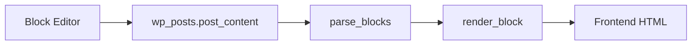
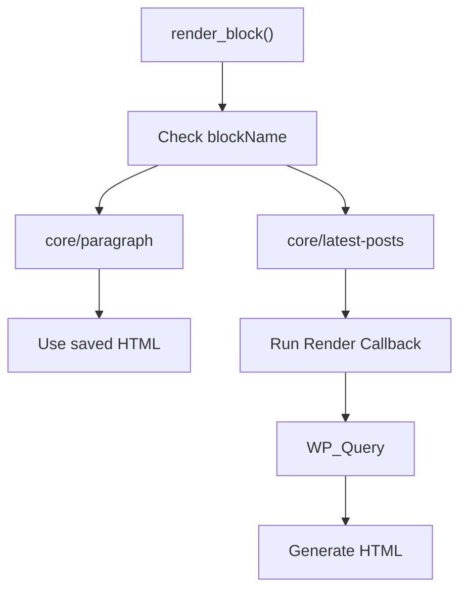
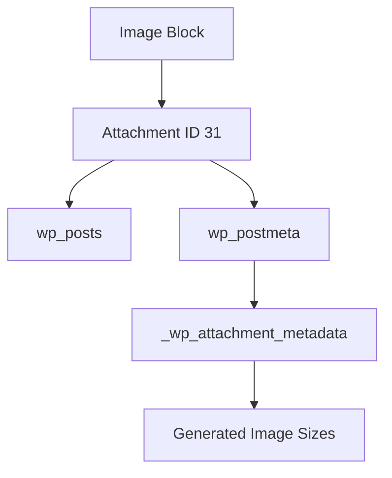

# WordPress Block Editor কিভাবে কাজ করে?

WordPress Classic theme এর মত WordPress Block Theme ও পোস্টের কনটেন্ট মূলত WordPress database-এই save হয়। Block editor যখন আপনি code editor এ ওপেন করবেন, তখন HTML comment এর মত কিছু কমেন্ট দেখতে পাবেন। এগুলোকে block markup বলা হয়। 

---

## How Gutenberg Stores Content

আমরা ব্লক এডিটরে যে কন্টেন্ট এড করি, এগুলো ব্লক মার্কআপ হিসাবে থাকে। এই কন্টেন্টগুলো ডাটাবেজের `wp_posts.post_content` field এ serialized block markup হিসাবে save হয়। 

### Example

```html
<!-- wp:paragraph -->
<p>Hello World</p>
<!-- /wp:paragraph -->

<!-- wp:image {"id":31,"sizeSlug":"large","linkDestination":"none"} -->
<figure class="wp-block-image size-large">
    
</figure>
<!-- /wp:image -->
```

---

## Database Structure

### Post Content

| Field          | Description                       |
| -------------- | --------------------------------- |
| `ID`           | Unique post ID                    |
| `post_type`    | post, page, attachment, etc.      |
| `post_status`  | publish, draft, inherit           |
| `post_content` | Serialized Gutenberg block markup |

### Example

| ID | post_type  | post_status |
| -- | ---------- | ----------- |
| 41 | post       | publish     |
| 31 | attachment | inherit     |

---

### ডাটাবেজ থেকে কন্টেন্ট কিভাবে প্রদর্শিত হয়?

### Paragraph Block

```html
<!-- wp:paragraph -->
<p>Hello World</p>
<!-- /wp:paragraph -->
```

উপরের ব্লক মার্কআপটি ডাটাবেজে plain text হিসাবে ডাটাবেজে সংরক্ষিত হয়। 

কিন্তু WordPress internally প্রায় এরকম structure তৈরি করে:

```json
{
  "blockName": "core/paragraph",
  "attrs": {},
  "content": "<p>Hello World</p>"
}
```

```php
Array(
    [0] => Array(
        [blockName] => "core/paragraph",
        [attrs] => Array(),
        [innerBlocks] => Array(),
        [innerHTML] => "<p>Hello World</p>",
        [innerContent] => Array(
            [0] => "<p>Hello World</p>"
        )
    )
)
```

### Image Block

```html
<!-- wp:image {"id":31,"sizeSlug":"large","linkDestination":"none"} -->
<figure class="wp-block-image size-large">
    
</figure>
<!-- /wp:image -->
```

```json
{
  "id": 31,
  "sizeSlug": "large",
  "linkDestination": "none"
}
```

```php
[
    [
        'blockName'    => 'core/image',
        'attrs'        => [
            'id' => 31,
            'sizeSlug' => 'large',
            'linkDestination' => 'none',
        ],
        'innerBlocks'  => [],
        'innerHTML'    => '<figure class="wp-block-image size-large">
            
        </figure>',
        'innerContent' => [
            '<figure class="wp-block-image size-large">
                
            </figure>'
        ],
    ]
]
```

### Paragraph with Attributes
```html
<!-- wp:paragraph {"className":"simple-text","style":{"css":"color:red;"},"anchor":"Hello-World"} -->
<p class="simple-text has-custom-css" id="Hello-World">Hello World!</p>
<!-- /wp:paragraph -->
```

```json
{
  "blockName": "core/paragraph",
  "attrs": {
    "className": "simple-text",
    "style": {
      "css": "color:red;"
    },
    "anchor": "Hello-World"
  },
  "innerBlocks": [],
  "innerHTML": "<p class=\"simple-text has-custom-css\" id=\"Hello-World\">Hello World!</p>",
  "innerContent": [
    "<p class=\"simple-text has-custom-css\" id=\"Hello-World\">Hello World!</p>"
  ]
}
```

```php
[
    [
        'blockName' => 'core/paragraph',

        'attrs' => [
            'className' => 'simple-text',

            'style' => [
                'css' => 'color:red;'
            ],

            'anchor' => 'Hello-World',
        ],

        'innerBlocks' => [],

        'innerHTML' =>
            '<p class="simple-text has-custom-css" id="Hello-World">Hello World!</p>',

        'innerContent' => [
            '<p class="simple-text has-custom-css" id="Hello-World">Hello World!</p>'
        ],
    ]
]
```

## Request Lifecycle



---

## Block Parsing

[Parse_blocks()]([https://wordpress.org/documentation/](https://developer.wordpress.org/reference/functions/parse_blocks/)) database থেকে block markup string পড়ে সেই markup কে parse করে structured PHP array তৈরি করে।

```php
$blocks = parse_blocks( $post->post_content );
```

```php
Array
(
    [0] => Array
        (
            [blockName] => core/paragraph
            [attrs] => Array()
            [innerBlocks] => Array()
            [innerHTML] => <p>Hello World</p>
        )
)
```

```php
<?php
function wpdocs_display_first_paragraph_block() {

    global $post;

    $blocks = parse_blocks( $post->post_content );

    foreach ( $blocks as $block ) {

        if ( 'core/paragraph' === $block['blockName'] ) {

            echo render_block( $block );

            break;
        }
    }
}
?>
```

```html
Hello World
```

## Rendering Blocks

render_block() হলো WordPress-এর একটি core function, যা parsed block array-কে frontend HTML-এ convert করে। এটি Block type identify করে ``` WP_Query ``` চালায় এবং HTML generate করে। 

```php
echo render_block( $block );
```

```php
if ( 'core/latest-posts' === $block['blockName'] ) {

    $query = new WP_Query(
        [
            'posts_per_page' => 5,
        ]
    );

    // Generate HTML
}
```



parse_blocks() ``` Markup → PHP Array ```
render_block() ``` PHP Array → HTML ```


---

## Image Block Relationship



---

## Dynamic vs Static Blocks

### Static Blocks

Rendered directly from saved content.

Examples:

* Paragraph
* Heading
* Image
* List

### Dynamic Blocks

Rendered at runtime.

Examples:

* Latest Posts
* Query Loop
* Site Title
* Navigation

---

## Block Theme-এর Template এবং Template Part কোথায় save হয়?

যদি Site Editor থেকে আপনি template edit করেন:

Template changes → wp_template
Template Part changes → wp_template_part

এগুলো database-এ custom post type হিসেবে save হয়, এবং wp_posts টেবিলেই থাকে।

---

## Key Takeaways

* Gutenberg stores content inside `wp_posts.post_content`
* Blocks are represented using HTML block markers
* `parse_blocks()` converts serialized markup into block objects
* `render_block()` generates frontend HTML
* Block Themes control presentation, not content storage
* Templates edited through the Site Editor like `wp_template` and `wp_template_part` are stored as custom post type
